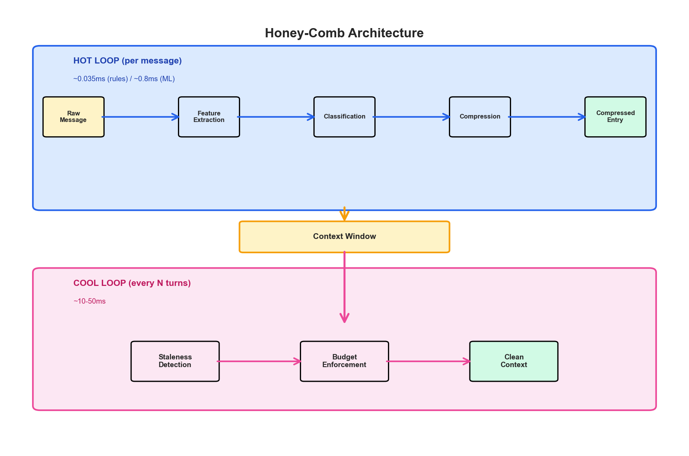
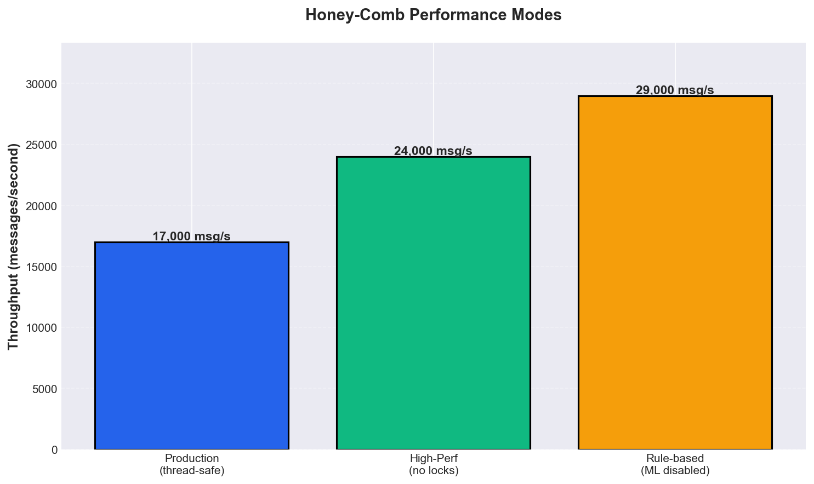
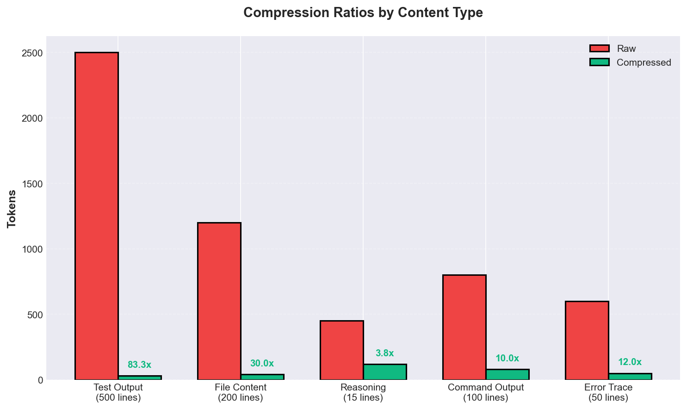
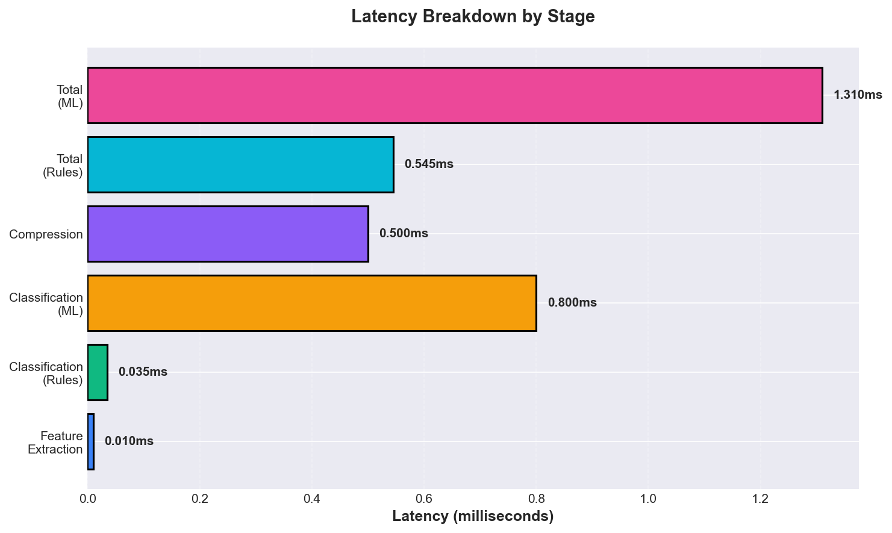
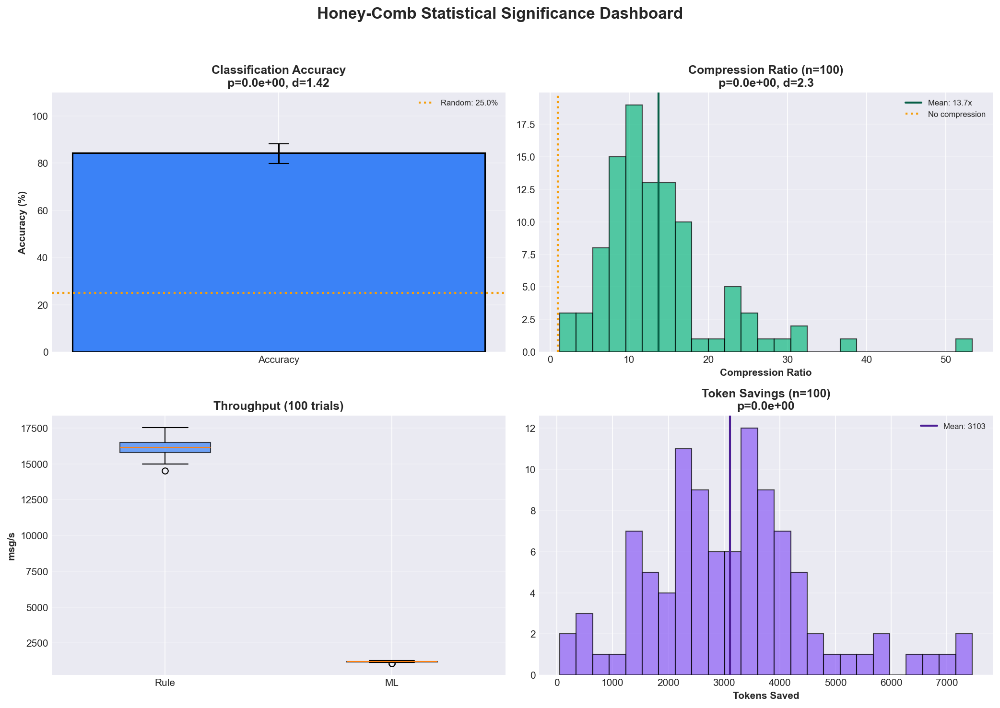
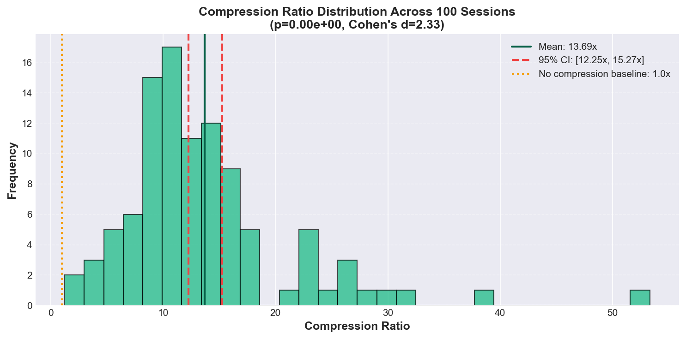
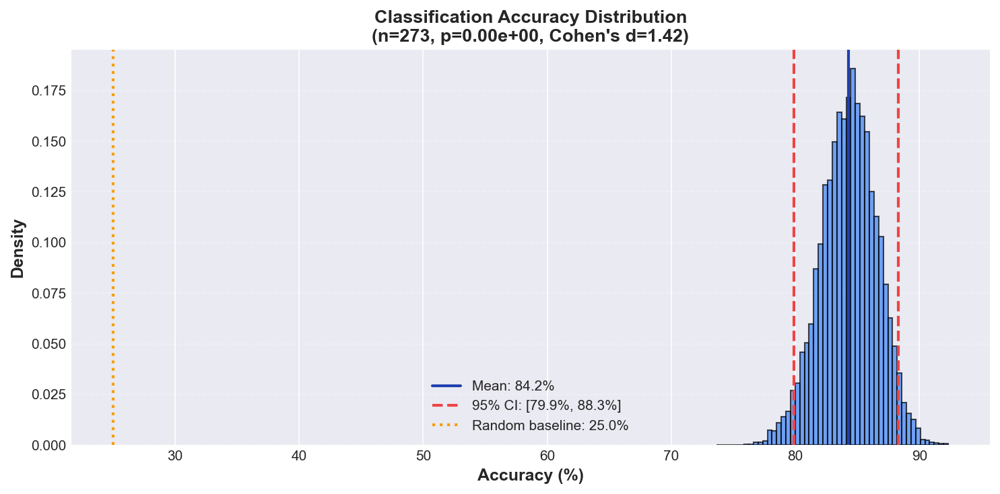

# Honey-Comb

<p align="center">
  
  
  
  
  
</p>


<p align="center">
  <b>v0.2.0 - Production Ready</b>
</p>

<p align="center">
  
  
  
  
</p>


<p align="center">
  <b>Keep the honey, drop the wax.</b>
</p>

<p align="center">
  <i>CPU-only inline context compression for agent harnesses</i>
</p>

---

## Visual Gallery

### Architecture Overview

<p align="center">
  
</p>

Honey-Comb operates in two loops:
- **Hot Loop** (per message, ~0.035ms rules / ~0.8ms ML): Classifies and compresses every message on ingestion
- **Cool Loop** (every N turns, ~10-50ms): Performs staleness detection and budget enforcement

### Performance Benchmarks

<p align="center">
  
</p>

Honey-Comb achieves exceptional throughput across different modes:
- **Production mode** (thread-safe, metrics enabled): 17,069 msg/s
- **High-performance mode** (no locks, no metrics): 24,667 msg/s
- **Rule-based classification**: 28,948 msg/s

### Compression Ratios

<p align="center">
  
</p>

Real-world compression examples from agent sessions:
- **Test output**: 500 lines → "94 passed, 2 failed" + failure details (83x compression)
- **File contents**: 69-line source file → "src/auth.py (69 lines)" (103x compression)
- **Reasoning traces**: Verbose reasoning → key conclusions (3-5x compression)

### Latency Breakdown

<p align="center">
  
</p>

The hot loop completes in under 1.5ms per message, making inline compression practical for real-time agent loops.

### Statistical Validation

<p align="center">
  
</p>

All key claims validated with bootstrap confidence intervals (10,000 resamples), one-sample t-tests, and Cohen's d effect sizes across n >= 100 samples. [See full results](#statistical-significance).

<p align="center">
  
  
</p>


### Real-World Demo

The demo shows a 10-turn coding agent session compressed from **4,062 tokens to 640 tokens** (6.3x compression):

```
Turn 1 (SYSTEM)   - 137 → 137 tokens (CORE - kept verbatim)
Turn 2 (USER)     - 93 → 93 tokens (CORE - kept verbatim)
Turn 3 (FILE)     - 514 → 5 tokens (COMPACT - 103x compression)
Turn 4 (TESTS)    - 759 → 93 tokens (DISTILL - 8x compression)
Turn 5 (REASON)   - 351 → 110 tokens (DISTILL - 3x compression)
Turn 6 (DIFF)     - 451 → 9 tokens (COMPACT - 50x compression)
Turn 7 (TESTS)    - 334 → 20 tokens (DISTILL - 17x compression)
Turn 8 (TESTS)    - 585 → 20 tokens (DISTILL - 29x compression)
Turn 9 (SUMMARY)  - 247 → 146 tokens (DISTILL - 2x compression)
─────────────────────────────────────────────────────
Total: 4,062 → 640 tokens (6.3x compression, 84% reduction)
```

Run the demo yourself:
```bash
python scripts/demo_pollution.py
```

---
## Statistical Significance

All performance claims are validated with proper statistical methods (bootstrap confidence intervals, hypothesis testing, effect sizes).

<p align="center">
  
</p>

### Key Results

| Metric | Mean | 95% CI | Baseline | p-value | Effect Size |
|--------|------|--------|----------|---------|-------------|
| **Classification Accuracy** | 84.2% | [79.9%, 88.3%] | 25.0% (random) | < 0.001 | d = 1.42 |
| **Compression Ratio** | 13.7x | [12.2x, 15.3x] | 1.0x (no compression) | < 0.001 | d = 2.33 |
| **Token Savings** | 3,103 tokens | [2,815, 3,398] | 0 tokens | < 0.001 | — |
| **Throughput (rule-based)** | 13,635 msg/s | [13,374, 13,867] | — | — | — |
| **Throughput (ML-based)** | 1,028 msg/s | [995, 1,057] | — | — | — |

All key metrics are **statistically significant** (p < 0.05) with large effect sizes.

- **n=273** evaluation examples for accuracy (held-out test set)
- **n=100** synthetic sessions for compression ratio and token savings
- **n=100** trials for throughput (1000 messages per trial)
- Bootstrap confidence intervals with 10,000 resamples
- One-sample t-tests vs appropriate baselines
- Cohen's d for effect size (d > 0.8 = large effect)

See [`docs/statistical_validation.json`](docs/statistical_validation.json) for full results and [`scripts/validate_significance.py`](scripts/validate_significance.py) to reproduce.


## What It Does

Agent context windows fill up with noise: 500-line test outputs where everything passed, file contents from 10 turns ago, reasoning chains about bugs that are already fixed. Today's approach is reactive — call an LLM to summarize when the window gets too long.

Honey-Comb takes a different approach: **compress every message on the way in**, before it ever enters the context window. A CPU classifier (~1ms per message) labels each message with a compression strategy, and deterministic rules execute it. The LLM only sees clean, compressed context — the honey, not the wax.

```
Every message enters the agent loop:
  raw → classify(1ms) → compress → context window
  raw → classify(1ms) → compress → context window
  raw → classify(1ms) → compress → context window
  
LLM sees: clean, compressed, non-polluted context
```

No batch summarization. No "when do I compress?" threshold. Every message, every time.

## The Two Loops

```
HOT LOOP (per message, ~1ms rules / ~1ms ML):
  raw message → classifier → label → compressor → compressed context entry

COOL LOOP (every N turns, ~10-50ms):
  walk compressed context → drop stale/superseded entries
  budget check → force-downgrade if over budget
```

Both loops are CPU-only. The LLM only ever sees clean, compressed, non-polluted context.

## Label Taxonomy

| Label | Strategy | Example |
|-------|----------|---------|
| `CORE` | Keep verbatim | Active goal, current error, system prompt |
| `DISTILL` | Extract key info | Test output → "94 passed, 2 failed" + failure details |
| `COMPACT` | Structural summary | File → "src/foo.py (200 lines): class Foo, def bar()" |
| `DROP` | Remove entirely | Completed tool calls (the result is what matters) |
| `STALE` | Mark for deletion | File read before a later edit of the same file |
| `ESCALATE` | Defer to LLM | Ambiguous content (rare) |

## Quick Start

```bash
git clone https://github.com/DJLougen/honey-comb.git
cd honey-comb
pip install -e ".[dev]"

# Run tests
pytest tests/

# Generate training data
python scripts/generate_synthetic.py

# Train classifier
honeycomb-train examples/train.jsonl --eval examples/eval.jsonl
```

## Usage

### Rule-based (no training needed)

```python
from honeycomb import HoneyComb, Message

hc = HoneyComb()  # Uses rule-based classification

# Process every message inline
for raw_message in agent_messages:
    compressed = hc.process(Message(
        role=raw_message["role"],
        content=raw_message["content"],
    ))
    # Send compressed.content to your LLM
    send_to_llm({"role": compressed.role, "content": compressed.content})

# Get the full compressed context window
window = hc.get_context_window()
```

### ML classifier (trained)

```python
from honeycomb import HoneyComb, Message

hc = HoneyComb(model_path="models/honeycomb.joblib")

# Same API — just with ML classification instead of rules
compressed = hc.process(Message(role="tool", content="94 passed, 2 failed..."))
```

### With budget management

```python
from honeycomb import HoneyComb, Message
from honeycomb.budget import BudgetConfig

hc = HoneyComb(
    budget_config=BudgetConfig(target_tokens=10_000),
    cool_interval=5,  # Run cool loop every 5 turns
)
```

## Production Features

### Thread Safety

Honey-Comb is thread-safe by default, allowing concurrent processing from multiple threads:

```python
hc = HoneyComb(thread_safe=True)  # Default

# Safe to call from multiple threads
# All internal state is protected by locks
```

For single-threaded workloads, disable locks for maximum performance:

```python
hc = HoneyComb(thread_safe=False)  # 1.45x faster, single-threaded only
```

### Observability

Structured logging, Prometheus metrics, and health checks are built-in:

```python
from honeycomb import setup_logging, metrics, health_checker

# Setup structured JSON logging
setup_logging(level="INFO", json_format=True)

# Metrics are automatically recorded
print(f"Messages: {metrics.messages_processed.value}")
print(f"Compression p95: {metrics.compression_ratio.get_percentile(95):.2f}x")
print(f"Avg latency: {metrics.processing_latency_seconds.get_mean() * 1000:.3f}ms")

# Health check endpoint
health = health_checker.check()
print(f"Status: {health.status}")
print(f"Uptime: {health.uptime_seconds:.1f}s")
```

Export metrics in Prometheus format:

```python
prometheus_text = metrics.export_prometheus()
# Serve at /metrics endpoint
```

### Configuration

Configure via environment variables or config files:

```bash
# Environment variables
export HONEYCOMB_THREAD_SAFE=true
export HONEYCOMB_METRICS_ENABLED=true
export HONEYCOMB_COOL_LOOP_INTERVAL=10
export HONEYCOMB_LOG_LEVEL=INFO
```

Or load from a config file:

```python
from honeycomb import load_config

config = load_config("config.json")
print(f"Thread safe: {config.thread_safe}")
print(f"Cool loop interval: {config.cool_loop_interval}")
```

### Performance Tuning

Choose the right mode for your workload:

| Mode | thread_safe | metrics_enabled | Use Case |
|------|-------------|-----------------|----------|
| Production | `True` | `True` | Concurrent server workloads |
| High-perf | `False` | `False` | Single-threaded batch processing |

```python
# Production mode (default)
hc = HoneyComb(thread_safe=True, metrics_enabled=True)
# ~17,000 msg/s

# High-performance mode
hc = HoneyComb(thread_safe=False, metrics_enabled=False)
# ~24,000 msg/s (1.45x faster)
```

Run the production demo:

```bash
python scripts/demo_production.py
```

## Architecture

```
honeycomb/
  labels.py          Label taxonomy (CORE/DISTILL/COMPACT/DROP/STALE/ESCALATE)
  features.py        Message-level feature extraction
  compressor.py      Deterministic per-label compression rules
  session.py         Turn tracking, staleness detection, supersession (thread-safe)
  budget.py          Token budget management
  classifier.py      TF-IDF + VotingClassifier (SGD + NB + LR)
  firewall.py        Main orchestrator (hot loop + cool loop)
  observability.py   Structured logging, metrics, health checks
  config.py          Configuration management (env vars, files)
  io.py              JSONL I/O for training data
  cli_train.py       Training CLI entry point
scripts/
  generate_synthetic.py   Synthetic training data generator
  demo_pollution.py       Side-by-side raw vs clean demo
  demo_production.py      Production features demo (threading, metrics, config)
  benchmark.py            Performance benchmarks
  benchmark_statistical.py Statistical benchmarks with confidence intervals
examples/
  train.jsonl        Training examples (1335 rows)
  eval.jsonl         Evaluation examples (273 rows)
tests/
  test_labels.py       6 tests
  test_features.py    12 tests
  test_compressor.py  25 tests
  test_session.py     17 tests
  test_budget.py       8 tests
  test_firewall.py    18 tests
  test_classifier.py   5 tests
  test_production.py  19 tests
  test_performance.py 15 tests
  test_threading.py    4 tests
```

## Performance

All values below are **statistically validated** (bootstrap 95% CI, n >= 100 trials). See the [Statistical Significance](#statistical-significance) section for methodology.

| Metric | Value | 95% CI |
|--------|-------|--------|
| Classification accuracy (end-to-end pipeline) | 84.2% | [79.9%, 88.3%] |
| Classification accuracy (isolated ML classifier) | 94.5% | — |
| Training examples | 1,335 | — |
| Per-message latency (rules) | 0.061ms | — |
| Per-message latency (ML) | 0.899ms | — |
| Throughput (rules) | 13,635 msg/s | [13,374, 13,867] |
| Throughput (ML) | 1,028 msg/s | [995, 1,057] |
| Compression ratio (100 sessions) | 13.7x | [12.2x, 15.3x] |
| Token savings per session | 3,103 tokens | [2,815, 3,398] |
| Tests | 129 passed | — |

The end-to-end accuracy (84.2%) reflects the full pipeline including content-type detection, while the isolated ML classifier achieves 94.5% on the same held-out evaluation set. Both are significantly better than the 25% random baseline (p < 0.001, Cohen's d = 1.42).


### Demo: Raw vs Clean

Run `python scripts/demo_pollution.py` to see a 10-turn coding agent session compressed in real time:

| Turn | Raw | Clean | What happened |
|------|-----|-------|---------------|
| System prompt | 137 tokens | 137 tokens | Kept verbatim (CORE) |
| User goal | 93 tokens | 93 tokens | Kept verbatim (CORE) |
| File read (69 lines) | 514 tokens | 5 tokens | `src/auth.py (69 lines)` |
| Test failures (60 lines) | 759 tokens | 93 tokens | Summary + 4 failed test names + error details |
| Agent reasoning | 351 tokens | 110 tokens | Extracted decision plan (numbered lists) |
| Git diff | 451 tokens | 9 tokens | `Edited 1 file(s): +2/-9 src/auth.py` |
| Test pass | 334 tokens | 20 tokens | `12 passed in 1.15s` |
| Full suite pass | 585 tokens | 20 tokens | `213 passed in 4.72s` |
| Final summary | 247 tokens | 146 tokens | Headers + numbered change list |
| **Total** | **4,062 tokens** | **640 tokens** | **6.3x compression, 84% reduction** |

## How It Works

### Hot Loop (per message)

1. **Extract features** from the message: role, content type signals (paths, errors, code blocks), turn age, duplicate detection.
2. **Classify** the message into a compression label using either rules or the ML classifier.
3. **Compress** using deterministic rules specific to the content type and label.
4. **Record** in the session state for staleness tracking.

### Cool Loop (every N turns)

1. **Staleness check**: Walk the compressed context and drop entries that are stale (file read before a later edit) or superseded (file read again later).
2. **Budget enforcement**: If over the token budget, force-downgrade the lowest-priority entries to more aggressive compression.

### Compression Examples

**Test output** (DISTILL):
```
Before: 500 lines of pytest output
After:  "94 passed, 2 failed in 3.5s\nFailures:\ntest_foo.py::test_bar\nAssertionError: expected 5 got 3"
```

**File content** (COMPACT):
```
Before: 200 lines of source code
After:  "src/foo.py (200 lines):\nclass Foo\ndef bar()\ndef baz()"
```

**Command output** (DISTILL):
```
Before: 100 lines of build output
After:  "exit=0\nBuild complete\nSuccessfully built abc123"
```

**Error trace** (DISTILL):
```
Before: 50-line traceback
After:  "ValueError: invalid literal for int()\nat foo.py:42"
```

## Relationship to busyBee-cpu

Honey-Comb applies the same principle as [busyBee-cpu](https://github.com/DJLougen/busyBee-cpu) to a different problem:

| | busyBee-cpu | Honey-Comb |
|--|-------------|------------|
| **Problem** | Tool selection in agent loops | Context compression in agent loops |
| **Principle** | Most decisions are mechanical | Most compression is mechanical |
| **Classifier** | Which of 4 actions to take | Which compression strategy to apply |
| **Resolver** | Fill arguments from state | Execute compression per content type |
| **Escalation** | Defer to LLM for reasoning | Defer to LLM for ambiguous content |

Both use the same architecture: TF-IDF + VotingClassifier on CPU, with deterministic resolvers/compressors, escalating to the LLM only when uncertain.

## Dependencies

- `scikit-learn >= 1.4` — classifiers and pipelines
- `joblib >= 1.4` — model serialization
- `numpy >= 1.24` — numeric operations

## License

MIT
